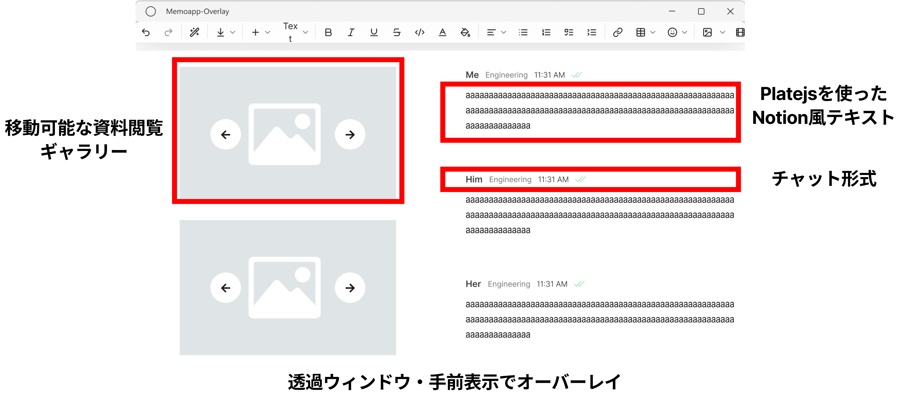

## Memoapp-Overlay v1
このアプリは「ゲーム中に簡単にメモが取れたらなー」という思いから作りました。\
アプリでは完全に透明なウィンドウにNotionぽくブロックでメモができるというものです。\
Ctrl+Alt+Vを押すことで編集モードと表示モードを切り替えます。\
使用例としては、ウィンドウフルスクリーンのゲーム上で攻略情報を常に見ながらプレイする。\
WEB会議中にウィンドウを分割することなくメモが取れる。\
などを想定して作りました。\
一応デモということで配布をします（exeファイル直貼りというやってはいけなさそうな配布の仕方ですが）\
https://drive.google.com/file/d/1jfAX-WeNWngS4Mb7X8jjTWbhnKh1TTNz/view?usp=sharing\
ちなみにメモ機能にはTipTapというNotion-likeなテンプレートを用いました。

## Memoapp-Overlay v2
今度はここに「共有機能」を盛り込んだものにしようと考えました。
共有はDiscordのチャットにヒントを経て、画像や動画などの資料に対してノーションライクなリッチテキストでチャットのようにメモができる機能を持たせようと考えました。
めちゃくちゃ雑で申し訳ないのですが、一応Figmaで作ってみました。

コンセプトとしては「Notion風テキストフォーマットの見易さ」×「時系列整理できるチャット」×「画像とテキストの関連が見やすいJamboard風フィールド」といった立ち位置でしょうか。